# The Emulation Tuning Kit
- [Download latest release](https://github.com/mercurious/etk/releases)
- [System Requirements](https://github.com/mercurious/etk/#etk-system-requirements)
- [Device Support](https://github.com/mercurious/etk/#handheld-system-support)
- [Tested Games](https://github.com/mercurious/etk/#tested-games-rpcs3)
- [Getting Started](https://github.com/mercurious/etk/#getting-started)

# ETK Introduction
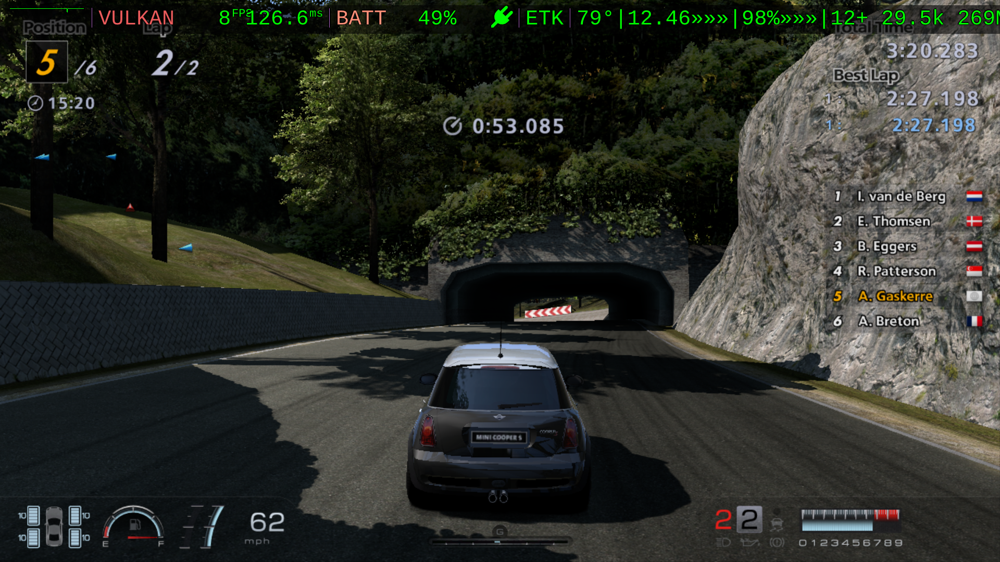

*GT6 — Trial Mountain, Lap 2 of 2, Position 5/6, Mini Cooper at 62 mph approaching the ivy-covered tunnel. DDU strip on top: `VULKAN 8FPS 126.6ms BATT 49% ETK 79° 12.46 96% 12+ 29.5k 269MB` — backend, framerate, frametime, battery, GPU temp, system load, GPU utilisation, new shaders harvested this session (`12+`), vault total (`29.5k`), live RAM. The `+` is the productive-crashing pitch made literal: the GPU is grinding hard, and the kit is banking every new shader for the next run.*

The Emulation Tuning Kit for Rocknix supports experimental PS3 emulation on ARM64 Retrogaming Handhelds. It excels at tuning games with device-specific emulation configurations while harvesting shaders into vaults. It also works by equipping your compatible handheld with special features to become a track day rig to literally and figuratively crash your way into making a game such as Gran Turismo 6 playable. Push your handheld to its limits while collecting shaders with tools to recover from crashes so the game plays well after several attempts. ETK automatically tracks sessions on a per-game race ledger.

## Racing UI
In the style of a race car Driver Data Unit (DDU) dashboard, the ETK instruments provide shader counts in real-time in a custom in-game overlay using MangoHUD support built-in to Rocknix. The kit also adds a custom ETK Pitstop app in the Rocknix Tools carousel menu for on-board telemetry analysis, quick tuning of Adreno-centric emulation settings, and simplified game package installation.

## Race Engineering
More technically, ETK is a custom Rocknix middleware composed of shell scripts and python curses that employ brute-force optimization, shader cache management, advanced in-game telematics, on-board screenshot tooling that includes the MangoHUD overlay, and operates an automated file-drop headless install of PS3 PKG installations inside of RPCS3.

## Race Durability
Built for abuse and race conditions, the ETK guards hard-earned shaders, custom tunings, screenshots, and game saves from SD card failure, OS flashing, data corruption, device failure, loss or theft. The ETK includes an emergency cooldown that automatically puts your device in PIT mode as needed, protecting your engine from overheating.

## Gallery
Captured on-device with the ETK's `L1` screenshot shutter — MangoHUD overlay included (which is the whole point; RPCS3's built-in screenshot strips it).

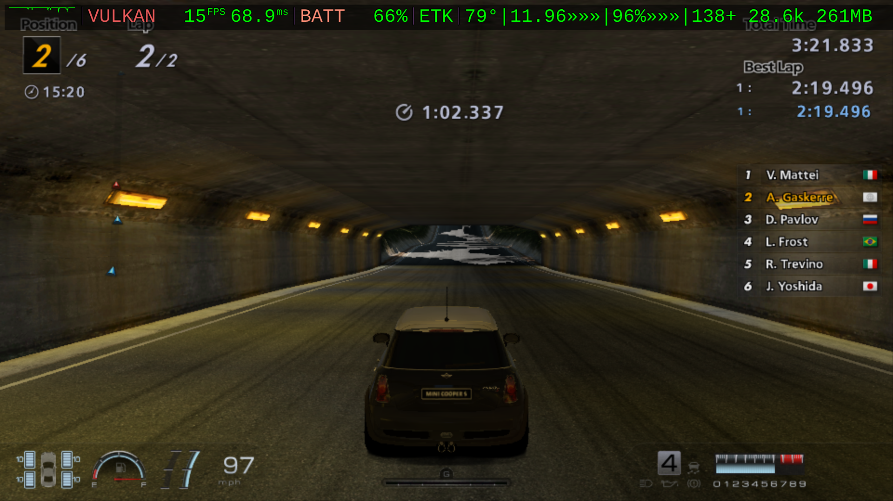

*GT6 — Trial Mountain, same ivy tunnel as the hero shot but a different race: Position 2/6, Lap 2/2, Mini Cooper at 97 mph. HUD: `VULKAN 15FPS 68.9ms BATT 66% ETK 79° 11.96 96% 138+ 28.6k 261MB` — **138 shaders harvested** by lap 2 because the cache from earlier laps is already paying out.*

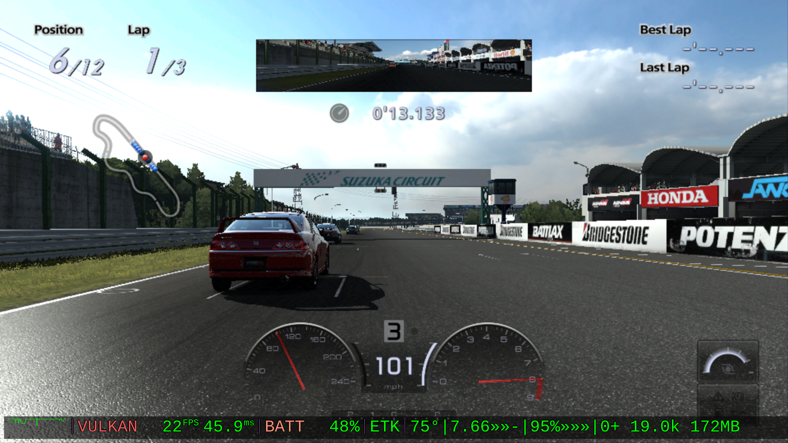

*GT5P — Suzuka Circuit start grid, Position 6/12, Lap 1/3, gear 3 at 101 mph. HUD: `VULKAN 22FPS 45.9ms BATT 48% ETK 75° 7.66 -95% 0+ 19.0k 172MB`. Honda / Bridgestone / Potenza trackside — daylight Suzuka renders cleanly on the cached set.*

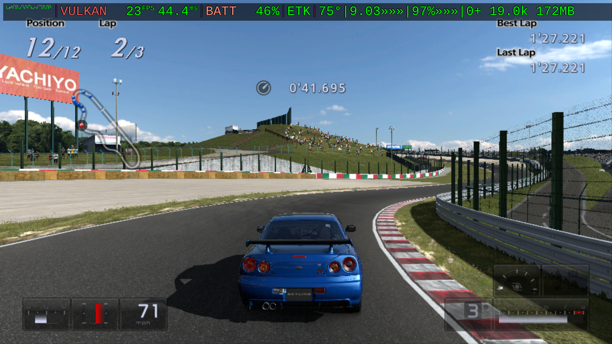

*GT5P — Suzuka, Position 12/12, Lap 2/3, blue Skyline GT-R at 71 mph into a sweeper. HUD: `VULKAN 23FPS 44.4ms BATT 46% ETK 75° 9.03 97% 0+ 19.0k 172MB`. Open daylight track on a saturated shader set is where the kit feels most like a stock console.*

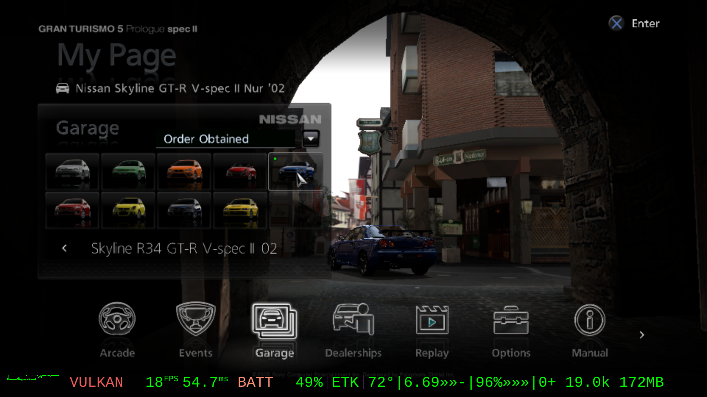

*GT5P — My Page / Garage. Player profile and car collection (`Skyline R34 GT-R V-spec II '02` selected). HUD: `VULKAN 18FPS 54.7ms BATT 49% ETK 72° 6.69 -96% 0+ 19.0k 172MB` — menus run on the cached shader set.*

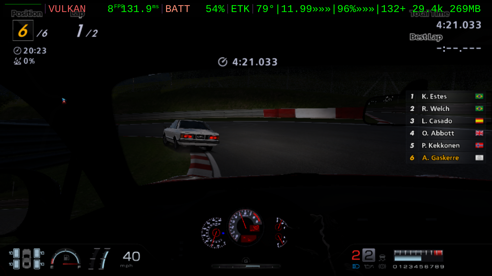

*GT6 — Nürburgring Nordschleife at night, Lap 1 of 2, cockpit view at 40 mph into a moonlit corner. HUD: `VULKAN 8FPS 131.9ms BATT 54% ETK 79° 11.99 96% 132+ 29.4k 269MB`. The Green Hell at night, on a handheld, running PS3. **A clean lap landed 2026-05-26.***

## ETK System Requirements
ETK is developed and structurally verified against Rocknix nightly 20260525–20260531 on SM8250 (Retroid Pocket Flip 2), with a hard architectural floor at 20260520 (DS5 gamepad era). No version yet certified as race stable, meaning five consecutive crash-free runs of the same target race to a graceful emulator exit.
| Type | Detail |
|---|---|
| Host System | macOS or Linux ([experimental Windows/PC support](#windows-install-guide)) |
| OS | ROCKNIX (Nightly Build: 20260531) |
| Driver | MESA Turnip 26.1.0 |
| Shell |  BusyBox v1.36.1 |
| Custom Overlay |  MangoHUD |

## Handheld System Support
The kit ships with one calibrated device profile (`SM8250`) which architecturally covers every SD865 / Adreno 650 / Turnip handheld. Only the Flip 2 has been on-rig verified so far; the other SD865 devices share the chipset and should run on the same profile, but each needs a real-world calibration pass to confirm thermal headroom and panel DPI. The RP6 needs a new SM8550 profile and a separate shader vault (Adreno 740 produces different cache binaries).

| Make | Model | Chipset | Profile | Status |
|---|---|---|---|---|
| Retroid Pocket | Flip 2 | SM8250 Adreno 650 | `SM8250` | 🏁 Verified |
| Retroid Pocket | 5 | SM8250 Adreno 650 | `SM8250` | Expected (untested) |
| Retroid Pocket | Mini | SM8250 Adreno 650 | `SM8250` | Expected (untested) |
| Retroid Pocket | Mini V2 | SM8250 Adreno 650 | `SM8250` | Expected (untested) |
| AYN | Thor Lite | SM8250 Adreno 650 | `SM8250` | Expected (untested) |
| Retroid Pocket | 6 | SM8550 Adreno 740 | (needs new profile + vault) | Not yet supported |

## Tested Games (RPCS3)
Snapshot of per-game status from on-device testing. Full tuning history, panic-ledger context, and the critical config dials per game live in [dossiers/etk_gametest_status_sheet.md](dossiers/etk_gametest_status_sheet.md). Extract sample shaders as `~/etk/vault/SM8250/[GameID]` and use `install.sh` to push them to the rig.

| ID | Game Config | Status | FPS | Audio| Notes | Shader Set |
|---|---|---|---|---|---|---|
| NPUA80075 | [Gran Turismo Prologue](config/config_NPUA80075.yml) | Playable | ~30 | Menus only | Primary ETK target. Track surface flickers; Unstable over time. | [.zip](https://drive.google.com/file/d/1gC7eTlfWRMuwYSIoMQuhzpyWujcWbv3Q/view) 151MB |
| NPEA90002 | [Gran Turismo HD](config/config_NPEA90002.yml) | Playable | 20–30 | Good (some race stutter) | Ideal baseline — small, fast, durable. Black sky artifacting; menus SPU-sensitive. | [.zip](https://drive.google.com/file/d/1c8Exq5Xlq2hikBlkVIFdu6Nw3TfsGoKB/view) 11 MB |
| NPUB30457 | [Ridge Racer 7](config/config_NPUB30457.yml) | Semi-Playable | 20-30 | Good (some race stutter) | No progress, not durable for 3 lap min. Distant backgrounds sometimes don't load. | - |
| NPUA80472 | [LittleBigPlanet](config/config_NPUA80472.yml) | Playable | 12-24 | Good (some stutter) | No issues discovered yet beyond shader storm glitching. | [.zip](https://drive.google.com/file/d/1BJuDP3bK57Z-rl2lOK-o0LDgGnXOL7N3/view) 7MB |
| NPEA00502 | [Gran Turismo 6](config/config_NPEA00502.yml) | Playable | <12 | Menus good | Full Nürburgring Nordschleife lap clean 2026-05-26. Tuning for FPS is deferred until the shader vault saturates. Rear-view mirror does not render. | [.zip](https://drive.google.com/file/d/1AUfvVzxwLCrTB31eDt_STqMMy5jPtKd1/view) 334MB |
| BCUS98114 | [Gran Turismo 5](config/config_BCUS98114.yml) | Menus only | — | Menus only | Tracks kernel-panic. Menus stable, eventual freeze. | [.zip](https://drive.google.com/file/d/1Jbex9koepwoSQNA0qqPhS9aseMufAKYp/view) 31MB |

## ETK Features
1. Native Rocknix ETK Pitstop App for on-device config editing, per game telemetry analysis over time, and simple PS3 game installation (drop .pkg and .rap in `roms/etk/pkg_install_drop/`)
1. Customized in-game overlay dashboard with ETK telematics inside native Rocknix MangoHUD
1. Hardware and driver tunings for maximum performance going beyond config settings
1. Optimized emulator game configurations tuned to the device hardware
1. Smart thermal protection to safely overdrive the device during shader harvesting
1. Automatic shader backup from your device to computer to shield hard earned work from loss and to share with other ETK users
1. Pit wall remote terminal screen to monitor and control device (`scripts/commander.sh`)
1. Install, configure, repair, and uninstall the kit remotely from a computer (`install.sh` and `uninstall.sh`) with mDNS autodiscovery of supported devices on your local network.
1. Multi-Installation Options: FULL installation for initial shader harvesting and tuning, LITE installation for saturated shader sets with thermal protection only, RAW for stress testing without shader and thermal protections (`ETK_BUILD_TYPE` in `etk.conf`)

# Getting Started
1. [Flash](https://rocknix.org/play/install/) a [Rocknix nightly build](https://github.com/ROCKNIX/distribution-nightly/releases) (see the exact build in [ETK System Requirements](#etk-system-requirements) above) to your handheld's SD card and complete its first-time setup so the rig joins your WiFi. 
If you've already installed Rocknix, simply press `START` `UPDATES & DOWNLOADS` `UPDATE BRANCH` and switch to `NIGHTLY` and then let the auto-update complete and reboot first. 
**Do not update to the next Rocknix nightly after this** without checking the latest README.md for the last known ETK supported Rocknix release.
2. Clone this repo to your computer. 
You can also download the code as a `.zip` and extract as `~/etk/`
3. Install the ETK onto your handheld rig

**For macOS, WLS2, Linux:** from the repo root
- run `chmod +x install.sh` to make it executable
- run `./install.sh` to install the ETK on your handheld rig
- Run `./install.sh` whenever you want to update, repair, or sync your rig.

**For Windows,** use the [PowerShell installer](https://github.com/mercurious/etk#windows-install-guide) which is a direct port of `install.sh` but use SMB backup to substitute for its file sync features.

**On the first run the installer auto-discovers your handheld as the rig.** You may be prompted once to accept the rig's SSH host key and enter the default root password unless you've changed it.
Using mDNS, Rocknix advertises itself on the LAN as `<SOC>.local` (e.g. `SM8250.local` for SD865 devices like the Retroid Pocket Flip 2 / Pocket 5).

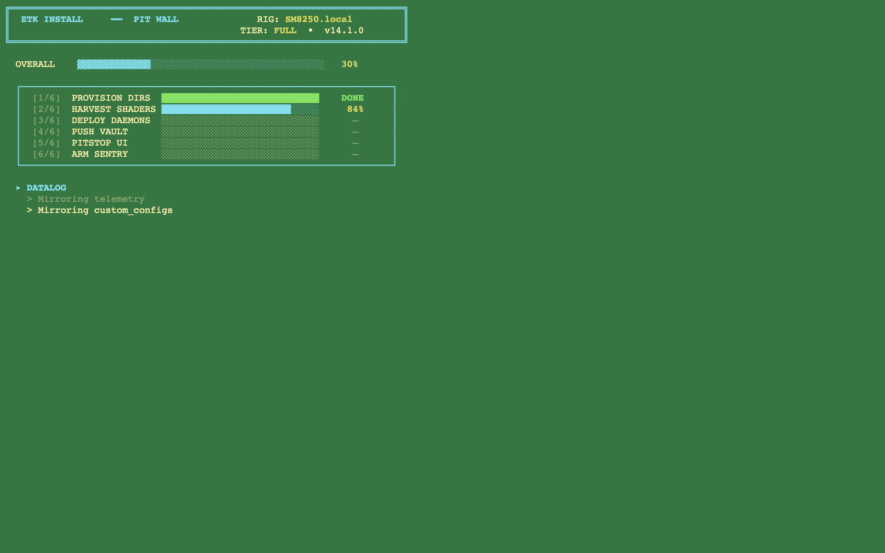

*The `./install.sh` Pit Wall console — `RIG: SM8250.local`, `TIER: FULL`. Six steps deploy bottom-up; the OVERALL bar aggregates them. The 2-line DATALOG at the bottom surfaces what's happening right now without firehosing per-file rsync output. Pass `--verbose` to swap this for the raw rsync stream when something needs diagnosis.*

4. Reboot and start harvesting shaders. 

# ETK Track Manual
Getting installed is the hard part. Now you have a track-day setup to attempt the previously impossible. You might not make it across the finish line your first attempt. But keep at it and you will.

## The Heads-Up Display
Designed to feel like a race car Driver Data Unit style dashboard (DDU). From left-to-right, the instruments are:
frametime|framerate|battery|ETK|temp|load|ram|shaders

### ETK DDU Startup Sequence
The custom display has a 3-step startup sequence. The duration can be edited in `etk.conf`
1. Shows the installation mode of the ETK: FULL, LITE or RAW|the game ID number|and the shader vault being loaded.
2. Shows the labels of the main instruments without shader info.
3. Minimizes instrument labels to include shader count and vault size.

### Gauge Indicators
- The TEMP gauge will show `HOT` when you are getting close to overheating.
  - It will show `OVERHEAT - REBOOT` when you trigger the thermal protection system.
- The core LOAD and RAM gauges have 3-step meters: `»--` `»»-` `»»»`
   - Don't think of these as proportional to the numbers,
   - Instead, think of these as your "system overhead" and when you are maxed out with all three segments, you are pushing the device to its known limits.

## The ETK Punch Box
Custom buttons to get you around the track at dangerous speeds.
| Gamepad Button | ETK Command | Button Description | Details |
|---|---|---|---|
| `L1` | **single-finger screenshot** | left top trigger button | **Requires in-game un-binding/un-mapping**. Screenshots stored at `/storage/roms/etk/screenshots`, `install.sh` syncs `etk/screenshots`. Disable `L1` one-finger trigger feature in ETK Pitstop > TOOLS > `3. Screeshot on L1: disabled` and use two-handed `SELECT` + `D-pad-up` instead. |
| `L3` | **DDU HUD** | left analog button | Toggles ETK DDU dashboard between top and bottom of screen |
| `R3` | **PANIC RECOVERY** | right analog button | Recover from a crash or freeze. Reboot recommended after returning to Rocknix ES frontend. |
| `POWER` | **Kernel Panic** | device's power button | If you cause a *kernel panic* the ETK Recovery function will not work. Hold the `POWER` button down until the device reboots to the Retroid Pocket logo. |

### Full chord reference:
- `SELECT` + `D-pad Up`: ETK SCREENSHOT (UI/menu fallback). Same capture as `L1` above; use this in Pitstop / EmulationStation / dealership / pause menu contexts where L1 has unwanted side effects (Pitstop tab nav). Not recommended in-race — SELECT also triggers the game's camera view toggle, so the captured frame will catch mid-transition.
- `SELECT` + `D-pad Right`: manual VAULT command (force a shader-vault tick)
- `SELECT` + `D-pad Left`: MangoHUD config reload signal

## The ETK Pitstop Rocknix App
Found in the Rocknix ES front-end Tools carousel item.

### ETK Telemetry
- Career
  - Shows total playtime, number of sessions, percent clean (no crashes), crash stats (recovery/panic)
  - Number of shaders banked, avg shaders per session, clean streak (best streak)
- Ledger: Shows session history at a glance
  - TIME|STATUS|DURATION|RAM|LOAD|TEMP|BATTERY DRAIN|SHADERS HARVESTED
  - Records every session and tuning change from the Tuning tab.
- Session Detail View
  - Clean View: Shows Duration and telemetry summary
  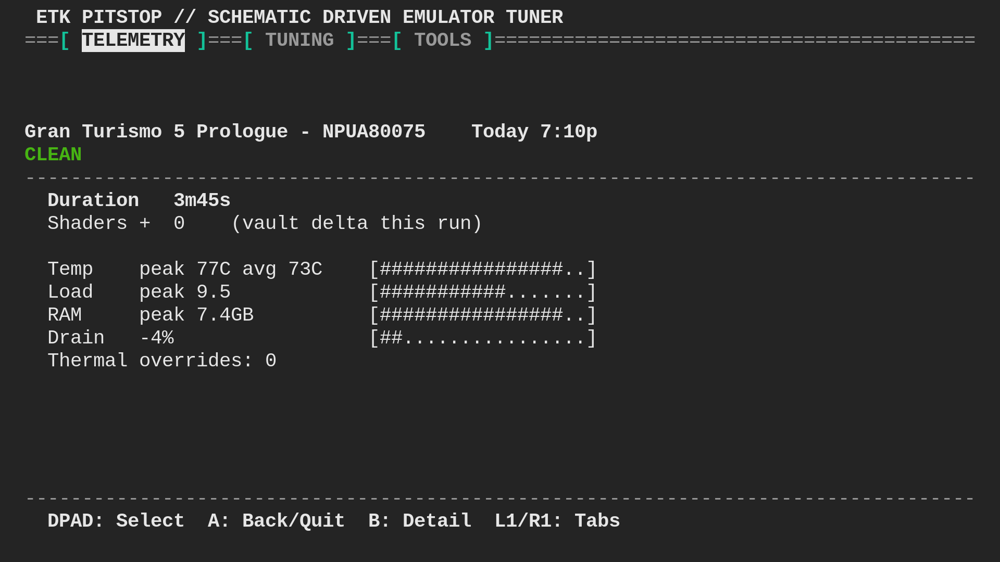  
  - Crash View: Shows crash type with explanation, peak stats, and **suggested Tuning fixes**.
  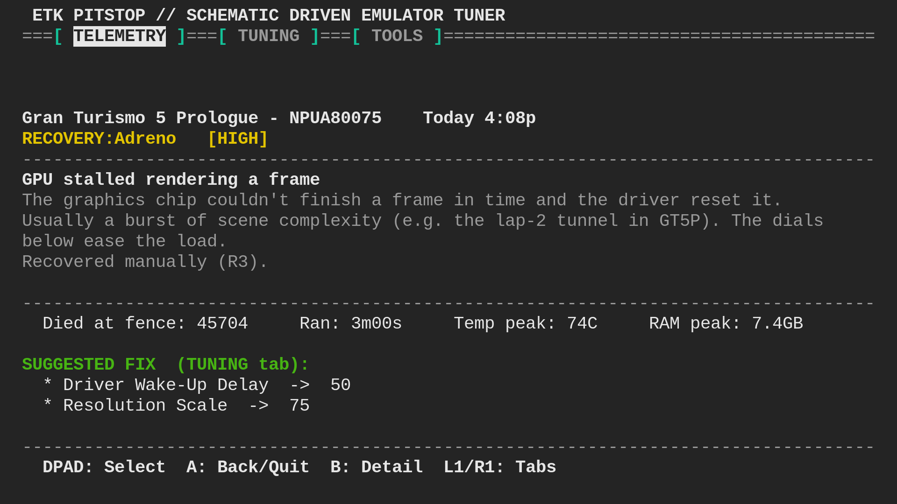
 
### ETK Tuning
Easily tweak emulation settings on the device. The subset of RPSC3 settings included can be customized in `config/pitstop_fields.json`
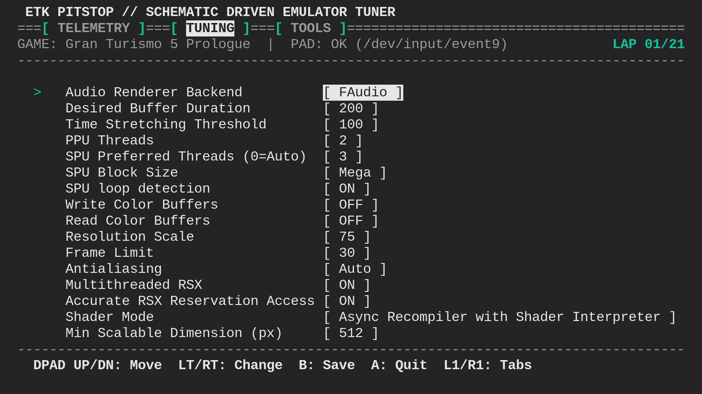

*ETK Pitstop TUNING tab for GT5P. The on-board subset of RPCS3 settings most relevant to per-game tuning, gamepad-editable in place. The exposed field set is defined in `config/pitstop_fields.json` — extend or trim per device. `B` saves to the per-game config; `L1`/`R1` cycle tabs.*


### ETK Tools
1. Easily install PS3 packages. Follow the on screen instructions and overlays during the automated process.
2. Easily uninstall PS3 packages
3. Configure the screenshot tool's `L1` single-finger camera-shutter feature to work always, on in-game, or never. The `SELECT` + `dpad-up` combo will continue to take ETK style screenshots.

## Getting Started with Rocknix Pro-tips
### To boot into Rocknix running on an SD card with Android as the default OS:
1. Start the device in Android and reboot. 
1. Before Retroid Pocket logo appears, hold down the Volume-Up button and let go as soon as you see the U-Boot logo (a little submarine icon in the corner)
### To always boot into Rocknix as the default OS:
1. Hold Volume-Down button while starting device to open loader menu
1. Use volume button to switch `Android` to `bootloader` and use the power button to set it.
1. Use the same process to revert back to Android.
### To share games between Rocknix and Android:
1. Store your games in `/storage/games-internal/roms/` and see [Rocknix documentation](https://rocknix.org/play/add-games/) for further details.
1. Let your Android apps gain permissions for this folder.
### To access your card after installing Rocknix:
Your PC or Mac will no longer read the card through an SD card reader over USB because of its Rocknix partition. Try one of these options instead: 
1. Use SMB in Windows or macOS to mount SM8250 as a drive
1. Use an SFTP client
1. Use [Rocknix USB-GADGET mode](https://rocknix.org/play/add-games/#option-2-usb-gaget-modes).

## How to Install PS3 Games with the ETK
The ETK solves the problem of installing PS3 Packages on Rocknix which is otherwise a ridiculous process.
1. Place a single PS3 `.pkg` and `.rap` into `/storage/roms/etk/pkg_install_drop/`
1. In Rocknix Tools > ETK Pitstop > TOOLS > Install a staged PS3 Package
1. Wait for the automated process where ETK will handle RPCS3 installation for you and follow the on screen overlay instructions
1. Quit ETK Pitstop after installation and run **Update Gamelists** in Rocknix so the newly-installed PS3 game appears in the PS3 system list. (Note: this does NOT refresh the ETK Pitstop entry itself — that's installed once by `./install.sh` and persisted by the Sentry.)

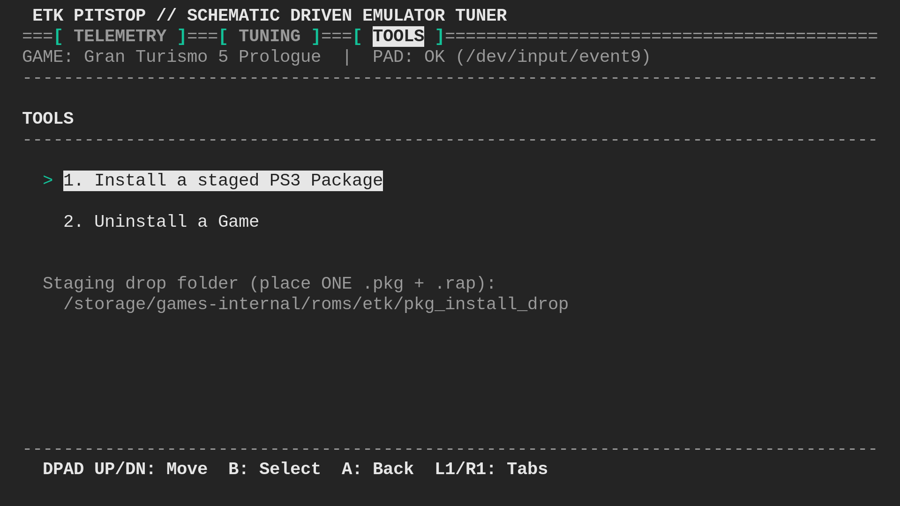

*ETK Pitstop TOOLS tab — headless PS3 `.pkg` installer. Drop one `.pkg` (plus a `.rap` licence if needed) into the staging folder shown, select **Install a staged PS3 Package**, and ETK drives RPCS3 through the install with overlay prompts. Solves the "you can't operate the RPCS3 desktop UI with just a gamepad" problem.*

## How to Use Simple Telemetry
ETK Pitstop's TELEMETRY tab shows the per-game session ledger of the last game launched. To switch the visible game, launch a different game in RPCS3, quit back to ROCKNIX, then reopen ETK Pitstop — it will show that game's career rollup and tuning history. Every session, every crash, and every config change is recorded so you can correlate tuning experiments with outcomes.

**Session detail:** in the TELEMETRY tab, move the row cursor with the **D-pad** and press the **confirm** button to open a full-screen detail card for that session (**back** returns). A clean run shows duration, shaders harvested, and ASCII gauges for temp / load / RAM / battery drain; a crash shows what failed, where it died, and the suggested tuning fix pulled from the crash-signature catalog.

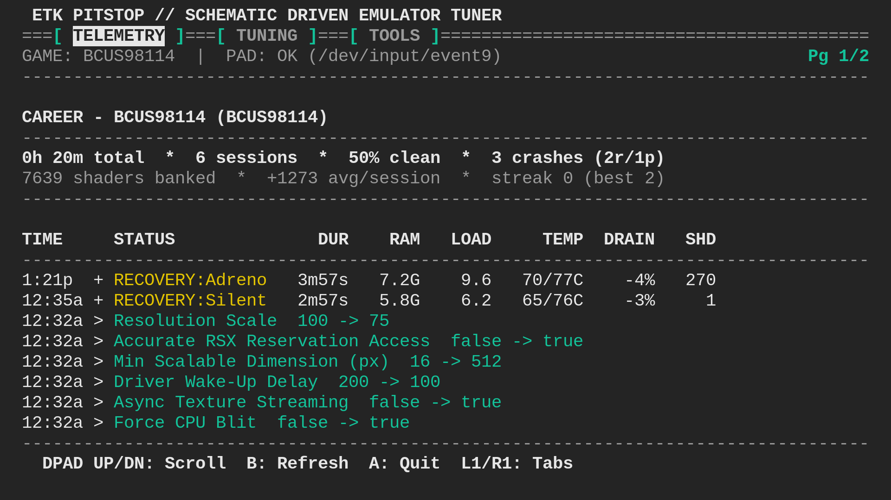

*ETK Pitstop TELEMETRY tab for Gran Turismo 5 (BCUS98114). Career rollup: **6 sessions · 50% clean · 3 crashes · 7,639 shaders banked · +1,273 avg/session**. The session log shows the full ledger schema — duration, RAM peak, load, GPU temp, battery drain, new-shader count, and the recovery signature (`RECOVERY:Adreno` = fence timeout, `RECOVERY:Silent` = soft hang). Config changes are logged inline so every tuning experiment is reproducible.*

## Customizing the ETK
1. The first run generates `etk.conf` from `etk.conf.example`
   - `RIG_SSH` — auto-populated to `root@<SOC>.local`; replace with a literal IP if your LAN blocks mDNS
   - `ETK_BUILD_TYPE` — `FULL` (shaders + thermal + HUD) / `LITE` (thermal + HUD) / `RAW` (HUD only)
   - `DEFAULT_MODE`, `HUD_HEADER_HOLD_S` (HUD launch-banner hold)
   - `ETK_VERBOSE` — 0 = Pit Wall console TUI (default), 1 = raw rsync output for debugging. Pass `--verbose` / `-v` on the install.sh CLI to force verbose for a single run.
2. Re-run `./install.sh` after any `etk.conf` edit to push changes to the rig.
3. Reboot the rig once to activate the ETK Pitstop entry in the Rocknix Tools menu.


## ETK File Structure
- `AI_MANIFEST.md`: System Manual and Immutable Laws of ETK Development for AI
- `LICENSE`: GNU GPL v2.0 — matches Rocknix
- `README.md`: You are reading it now.
- `CHANGELOG.md`: Release notes, newest first.
- `etk.conf.example`: Operator config template (committed). `install.sh` generates `etk.conf` from this on first run.
- `install.sh`: Flashes the ETK onto your handheld from a computer; auto-discovers the rig via mDNS on first run.
- `uninstall.sh`: Removes the ETK from your handheld from a computer; restores stock CPU/GPU governors before exiting.
- `/bin`:
  - `etk_modules_inject.py`: Handles installing the native Rocknix Pitstop app persistently
  - `etk_pitstop.py`: Native Rocknix Tools App — TELEMETRY, TUNING, TOOLS tabs
  - `gamepad_probe.py`: Gamepad inventory + mapping probe (dev utility)
  - `input_d.py`: Handles custom gamepad controls (R3 panic, L3 HUD toggle, L1 screenshot, SELECT chords)
  - `mango_bridge.sh`: Manages live telemetry and the in-game overlay display
  - `recovery.sh`: Headless Nuclear Recovery, invoked on-device by the `R3` panic button
  - `screenshot.sh`: `grim` Wayland capture, invoked by `L1` and `SELECT`+`D-pad Up`
  - `session_postmortem.sh`: Records Simple Telemetry to the Pitstop session ledger on game exit
  - `thermal_d.sh`: Manages system conditions and emergency PIT-mode cooldown
  - `vault_d.sh`: Archives compiled shaders to the per-game vault
- `/config`:
  - `crash_signatures.json`: Defines crash classification patterns for forensics
  - `etk_pitstop.sh`: Native Rocknix app launcher (deployed to `/storage/.config/modules/`)
  - `etk_pitstop.svg`: Native Rocknix app icon
  - `etk_template.yml`: Default RPCS3 per-game config template (used by the TOOLS-tab installer)
  - `MangoHud.conf`: ETK's custom in-game DDU overlay configuration
  - `pitstop_fields.json`: Subset of RPCS3 config keys exposed in the TUNING tab
  - `rsyncd.config`: Optional rsyncd configuration for backup paths
- `/scripts`:
  - `career_aggregate.sh`: Summarises the session ledger into career stats for the Pitstop TELEMETRY tab
  - `commander.sh`: Pit Wall DDU UI for the terminal interface (the live dashboard's voice and look)
  - `env.sh`: Establishes pit and race environment variables; sources the active device profile
  - `etk_probe.sh`: Three-mode thermal / freq probe for empirical thermal calibration
  - `probe.sh`: Provides forensic error logs from RPCS3 + dmesg
  - `/profiles`: Device profiles (one file per SoC family — `SM8250.sh` is the Tier-1 reference for SD865 handhelds)
- `/tools`: Host-side dev utilities. `tui.sh` is the Pit Wall console library shared by `install.sh` and `uninstall.sh`; the rest (`vault_doctor.sh`, `vault_sweep.sh`, `agnostify.sh`, etc.) are operator helpers. `etk_drift.py` runs on the rig to detect Rocknix OS-migration drift — it banks nightly-keyed OS profiles (by `OS_VERSION`, e.g. `20260525`) and diffs a live nightly against the pinned baseline (and against the device profile's assumptions) to decide whether a nightly is safe to adopt.
- `/dossiers`: Design dossiers driving the architecture (device-agnostic profile, rig self-update feasibility, telemetry, etc.).
- `/docs`: Public-facing assets including the screenshot gallery used by this README.
- `/vault`: Local mirror of the harvested shader bank, organised as `vault/<CHIPSET>/<GAME_ID>/shaders/` (gitignored; populated by `install.sh` Tier-A sync).
	
# FAQ: What is the ETK and How Does it Really Work?
- **To enhance how the built-in PS3 emulator handles shader caching,** the ETK intercepts the Vulkan shader cache with a simple symlink and safely stores these files into a vault folder on your SD card organized by device and game ID so they can be archived and shared. Even when you crash during a shader harvesting run, the vault has saved the shaders for the next run.
- **To enhance how the device handles high demand games during the shader compiling process and high performance gaming,** the ETK manages the system temp and performance to safely overtax the device when it needs to work the hardest while preventing a total meltdown. It also modifies how the OS manages virtual memory and fine tunes the video driver.
- **To enhance how you can monitor the device system stress while pushing it to its limits,** the ETK enables a custom dashboard overlay using built-in Rocknix features across a thin horizontal HUD strip designed to evoke the Driver Data Unit (DDU) found in GT and F1 racing cars. The custom HUD DDU also shows the number of shaders harvested during a game session so you realize even if you crash, it was worth it.
- **To streamline how you can tweak key emulation settings,** the ETK PITSTOP app in the Rocknix Tools menu, inspired by pit wall screens, allows you to easily adjust selected configuration settings using the gamepad controls. The subset of on-board configs can be customized in a JSON file. 
- **To solve the problem of installing `.pkg` files with the desktop version of RCPS3 inside of Rocknix with only a gamepad,** the ETK automates the process for you. All you do is drop files in a folder on your card and use ETK Pitstop Tools to start the process.
- **To simplify managing game shader vaults and software updates,** the ETK includes a simple command-line utility to install, repair, update, and automatically sync shader vaults as you harvest from games or trade device and game-specific shader folders with others. It also includes an uninstall utility to retire from the league. A typical game 300+ MB shader vault will involve tens of thousands of binary files so an efficient transfer mechanism to manage shader sets between a computer and the handheld devices is essential.
- ETK does all of this while trying to maintain a **minimal system footprint without subjecting your SD card to abuse.**

# Warnings and Recommendations
- Requires the patience and dedication of race car drivers. You will crash. But you will also win races that could otherwise not be played. ETK doesn't magically make your device run PS3 emulation, it only gives it a fighting chance with professional grade tools and system tunings. Shader sharing spares other players the harvest.
- Requires the exact Rocknix Nightly specified above. This does not work on the official release nor has it been tested or updated for other Rocknix nightly builds.
- Do not use your main ROM library SD card for this Rocknix install. Instead, use a reasonably sized (256GB or less) high quality dev card that you don't mind wearing out or needing to reflash. Put your favorite PS3 games on this card and wait until the ETK can be upgraded for a Rocknix (official) release before using on your main card.
- Do not install on your handheld device if you intend to use the warranty coverage or otherwise would protect it from track day abuse. If you wouldn't take your daily driver to the track, do not install highly experimental software on your only retro handheld that could potentially damage or brick it.
- OS updates, ETK uninstalls and other major system events may require a PPU recompilation which do take time. Putting the device on an ice pack or in the refrigerator will reduce thermal stress on the system during these intensive operations. 
- The ETK is designed with community shader sharing in mind.
	  
# Windows Install Guide
## alpha-tester preview

Two ways to run the ETK host tooling from Windows:

**1. Native PowerShell installer (`windows_installer/`) — no WSL required.** A dependency-free port of `install.sh` / `uninstall.sh`. On first run it **auto-pairs over SSH** — you type the rig password once (Rocknix default `rocknix`), and every call after that is silent. The rig-side logic (Sentry, systemd unit, and the SSH key-install) is read verbatim out of the bash scripts, so there is no second copy to drift. Full guide: **[windows_installer/WINDOWS_HOST_README.md](windows_installer/WINDOWS_HOST_README.md)**.
```powershell
powershell -ExecutionPolicy Bypass -File .\windows_installer\etk-install.ps1
```
This path is **no-vault** — it does not back your shaders up to the PC (the rig still vaults locally; see [Manual SMB Backup](#manual-smb-backup)). Pairing and a full install are verified on a real SM8250 rig; treat the rest as alpha and use a dev card.

**2. WSL2 (full-featured).** For the complete experience including host-side shader-vault backup/restore (Tier-B), install WSL2 + Ubuntu, clone the kit, and follow [Getting Started](#getting-started) above unchanged — `install.sh` runs in WSL2 with no modifications.

For the one-time fresh-card flash, use the official Rocknix [ImageBurner](https://github.com/ROCKNIX/ImageBurner/releases) — Windows-native, no dependency, to install the correct nightly (not official) required for the ETK.

## Manual SMB Backup
- (the native PowerShell installer is no-vault, so use this for shader backups on Windows)
If you are on the PowerShell installer (no Tier-B host backup) or want belt-and-suspenders, Rocknix exposes Samba shares natively. In File Explorer, `Map network drive...` → `\\<rig-ip>\games-internal` → assign a letter (e.g. `R:`). Then save this as `etk_backup.bat` and run it before any reflash or risky migration:

```bat
robocopy R:\roms\etk\vault                  C:\etk_backup\vault           /MIR /R:1 /W:1
robocopy R:\roms\etk\etk_telemetry          C:\etk_backup\etk_telemetry   /MIR /R:1 /W:1
robocopy R:\roms\bios\rpcs3\custom_configs  C:\etk_backup\custom_configs  /MIR /R:1 /W:1
robocopy R:\roms\bios\rpcs3\dev_hdd0\home   C:\etk_backup\rpcs3_home      /MIR /R:1 /W:1
```

`robocopy /MIR` is Windows-native (no install), incremental like `rsync`, and idempotent — re-run as often as you like. To restore after a reflash, swap source and destination in each line. **Manual caveat:** you must remember to run the backup yourself; there is no Windows equivalent of `install.sh --restore-state` yet.


# AI Disclosure
ETK was originally prototyped with Google Gemini and developed/maintained with Anthropic Claude Code.

# License
ETK is released under the [GNU General Public License v2.0](LICENSE), matching the licensing of [Rocknix](https://github.com/ROCKNIX/distribution) which it extends.

Copyright (C) 2026 mercurious
