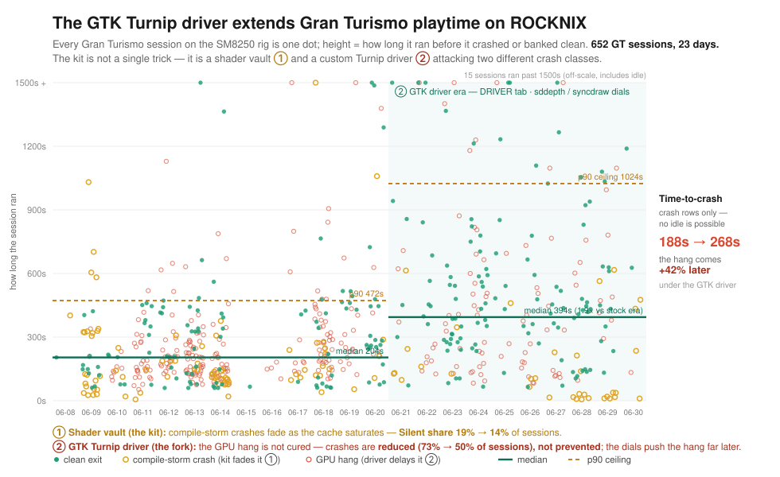

# The Emulation Tuning Kit
## For Android
No ETK features, just house tuned.
- Use [aPS3e Shader Patch Edition](https://github.com/mercurious/aps3e/releases) for Android (until main release is updated with cache fix)
- Use the latest [ETK MESA Turnip drivers](https://github.com/mercurious/aps3e/releases/tag/etk-turnip-26.1.3) for Android during the aPS3e setup wizard or configuration.
- Use an ETK config tuning from [Tested Games](https://github.com/mercurious/etk/wiki/Tested-Games).
- Try the ETK [Claude Code Cockpit skill](https://github.com/mercurious/etk/wiki/Claude-Cockpit-Skill) for real-time pit-engineering advice, crash forensics, tuning suggestions, track photography analysis and more. Works over USB with any Android device and USB & `ssh` on ROCKNIX.
  
## For the full ROCKNIX rig
The complete high performance system.
- [Download latest release](https://github.com/mercurious/etk/releases)
- [System Requirements](https://github.com/mercurious/etk/#etk-system-requirements)
- [ETK Wiki](https://github.com/mercurious/etk/wiki) for full documentation, guides, advanced features
- [Device Support](https://github.com/mercurious/etk/#handheld-system-support)
- [Tested Games](https://github.com/mercurious/etk/wiki/Tested-Games)
- [Getting Started](https://github.com/mercurious/etk/#getting-started)

# ETK Introduction


*Every Gran Turismo session on the rig is one dot; height = how long it ran before it crashed or banked clean. The kit attacks two crash classes with two mechanisms — a **shader vault** (compile-storm crashes fade as it saturates) and a **custom GTK Turnip driver** (the GPU hang comes **~42% later** — reduced, not cured). Median playtime roughly **doubles** in the GTK-driver era. Generated from the live race ledger. See the [ETK Screenshot Gallery](https://github.com/mercurious/etk/wiki/ETK-Screenshot-Gallery) on the Wiki for on-device captures.*

The Emulation Tuning Kit for ROCKNIX supports experimental PS3 emulation on ARM64 Retrogaming Handhelds. It excels at tuning games with device-specific emulation configurations while harvesting shaders into vaults. **ETK does not share or distribute shaders** — it manages your own, archived privately to your own GitHub, so your rig can swap games and their vaults on the go without a host computer. It also works by equipping your compatible handheld with special features to become a track day rig to literally and figuratively crash your way into making a game such as Gran Turismo 6 playable. Push your handheld to its limits while collecting shaders with tools to recover from crashes so the game plays well after several attempts. ETK automatically tracks sessions on a per-game race ledger.

## Racing UI
In the style of a race car Driver Data Unit (DDU) dashboard, the ETK instruments provide shader counts in real-time in a custom in-game overlay using MangoHUD support built-in to ROCKNIX. The kit also adds a custom ETK Pitstop app in the ROCKNIX Tools carousel menu for on-board telemetry analysis, quick tuning of Adreno-centric emulation settings, and simplified game package installation.

## Race Engineering
More technically, ETK is a custom ROCKNIX middleware composed of shell scripts and python curses that employ brute-force optimization, shader cache management, advanced in-game telematics, on-board screenshot tooling that includes the MangoHUD overlay, operates an automated file-drop headless install of PS3 PKG installations inside of RPCS3, and automatically archives shaders into an optional private, unshared cloud repository on GitHub.

## Race Durability
Built for abuse and race conditions, the ETK guards hard-earned shaders, custom tunings, screenshots, and game saves from SD card failure, OS flashing, data corruption, device failure, loss or theft. The ETK includes an emergency cooldown that automatically puts your device in PIT mode as needed, protecting your engine from overheating — and **automatically recovers back to racing once it cools, with no reboot required**.

## Gallery
On-device captures — MangoHUD overlay included (RPCS3's built-in screenshot strips it) — live in the **[ETK Screenshot Gallery](https://github.com/mercurious/etk/wiki/ETK-Screenshot-Gallery)** on the Wiki.

## ETK System Requirements
ETK is certified against **ROCKNIX nightly `20260622`** on SM8250 (Retroid Pocket Flip 2), with a hard architectural floor at 20260520 (DS5 gamepad era). The pin tracks the nightly cadence deliberately: nightly-20260610 first shipped RPCS3 `0.0.41-19444`, which contains the upstream Gran Turismo 5 memory-leak fix ([RPCS3 #18819](https://github.com/RPCS3/rpcs3/issues/18819), ~300 MB leaked per car viewed — fatal on an 8 GB handheld and the prime suspect behind the former dominant "silent crash" class), plus Mesa Turnip 26.1.2 and kernel 7.0.11; certification has since tracked forward to `20260622` (kernel 7.0.11 unchanged). Official release `20260601` predates the fix. The race-stability bar — five consecutive crash-free runs of the same target race to a graceful emulator exit — has been **cleared on GT5 Prologue** (best streak: 16 crash-free sessions / 8 back-to-back clean finishes). That result was earned on a **saturated** shader vault; it is **not yet consistently reproducible from a fresh install**, where the rig re-enters the harvest cycle and crashes until the cache re-saturates. Race-stable is proven *reachable*, not guaranteed every session.
| Type | Detail |
|---|---|
| Host System | macOS or Linux native ([Windows/PC port](#windows-install-guide)) |
| OS | ROCKNIX (Nightly: 20260622) |
| Driver | MESA Turnip 26.1.2 |
| Shell |  BusyBox v1.36.1 |
| Custom Overlay |  MangoHUD |

## Handheld System Support
The kit ships with one calibrated device profile (`SM8250`) which architecturally covers every SD865 / Adreno 650 / Turnip handheld. Only the Flip 2 has been on-rig verified so far; the other SD865 devices share the chipset and should run on the same profile, but each needs a real-world calibration pass to confirm thermal headroom and panel DPI. The RP6 needs a new SM8550 profile and a separate shader vault (Adreno 740 produces different cache binaries).

| Make | Model | Chipset | Profile | Status |
|---|---|---|---|---|
| Retroid Pocket | Flip 2 | SM8250 Adreno 650 | `SM8250` | 🏁 Verified |
| Retroid Pocket | 5 | SM8250 Adreno 650 | `SM8250` | Expected (untested) |
| Retroid Pocket | Mini | SM8250 Adreno 650 | `SM8250` | Expected (untested) |
| Retroid Pocket | Mini V2 | SM8250 Adreno 650 | `SM8250` | Expected (untested) |
| AYN | Thor Lite | SM8250 Adreno 650 | `SM8250` | Expected (untested) |
| Retroid Pocket | 6 | SM8550 Adreno 740 | (needs new profile + vault) | Not yet supported |

## ETK Features
1. Native ROCKNIX ETK Pitstop App for on-device config editing, per game telemetry analysis over time, simple PS3 game installation (drop .pkg and .rap in `roms/etk/pkg_install_drop/`), and an optional private shader repo (PADDOCK tab)
1. Customized in-game overlay dashboard with ETK telematics inside native ROCKNIX MangoHUD
1. Hardware and driver tunings for maximum performance going beyond config settings
1. Optimized emulator game configurations tuned to the device hardware
1. On-device **DRIVER tab** to swap the whole Mesa/Turnip **driver build** (a `DRIVER BUILD` selector over the on-rig catalog of `.so`s you stage in `drivers/` — your own fork, the stock OS driver, or community Adreno-650 builds; pick + reboot to load, with the live build shown in the header) *and* to A/B its dials (`TU_AUTOTUNE_ALGO` + the `TU_DEBUG` ladder), with every race session stamped in the ledger with the exact dial set it ran under
1. **Crash-cam** — every recoverable freeze is photographed at the `R3` panic and bound to its race-ledger entry, viewable full-screen on the device (crash signature + frame + dial, all linked)
1. Smart thermal protection to safely overdrive the device during shader harvesting, with automatic overheat recovery that returns to racing once cooled — no reboot
1. Automatic shader backup from your device to your computer to shield hard-earned work from loss, plus an optional **Private Paddock** — push/pull your shaders, tunes, and saves to your own private GitHub repo straight from the rig over WiFi (self-custody, nothing shared publicly), and **Manage Shaders** to reclaim storage by sweeping shaders stranded by driver updates
1. Pit wall remote terminal screen to monitor and control device (`scripts/commander.sh`)
1. Install, configure, repair, and uninstall the kit remotely from a computer (`install.sh` and `uninstall.sh`) with mDNS autodiscovery of supported devices on your local network.
1. Multi-Installation Options: FULL installation for initial shader harvesting and tuning, LITE installation for saturated shader sets with thermal protection only, RAW for stress testing without shader and thermal protections (`ETK_BUILD_TYPE` in `etk.conf`)

# Getting Started
1. [Flash](https://rocknix.org/play/install/) the [ROCKNIX nightly](https://github.com/ROCKNIX/distribution-nightly/releases) certified in [ETK System Requirements](#etk-system-requirements) above (`20260622`) to your handheld's SD card and complete its first-time setup so the rig joins your WiFi. 
If you've already installed ROCKNIX, switch the update channel to nightly (`START` → `UPDATES & DOWNLOADS`), update to the certified nightly, and let the auto-update complete and reboot first. 
**Do not update past the certified nightly** without checking the latest README.md for the last known ETK-supported ROCKNIX build.
2. Clone this repo to your computer.
```sh
git clone https://github.com/mercurious/etk
```
- (You can also download the code as a `.zip` and extract as `~/etk/`).
3. Install the ETK onto your handheld rig

**For macOS, WLS2, Linux:** from the repo root
to make it executable
```sh
chmod +x install.sh
```
to install the ETK on your handheld rig
```sh
./install.sh
```
whenever you want to update, repair, or sync your rig, `cd ~/etk` or wherever you keep it
```sh
./install.sh
```

**For Windows,** use the [PowerShell installer](https://github.com/mercurious/etk#windows-install-guide) which is a direct port of `install.sh` but use SMB backup to substitute for its file sync features.

**On the first run the installer auto-discovers your handheld as the rig.** You may be prompted once to accept the rig's SSH host key and enter the default root password unless you've changed it.
Using mDNS, ROCKNIX advertises itself on the LAN as `<SOC>.local` (e.g. `SM8250.local` for SD865 devices like the Retroid Pocket Flip 2 / Pocket 5).


*The `./install.sh` Pit Wall console — `RIG: SM8250.local`, `TIER: FULL`. Six steps deploy bottom-up; the OVERALL bar aggregates them. The 2-line DATALOG at the bottom surfaces what's happening right now without firehosing per-file rsync output. Pass `--verbose` to swap this for the raw rsync stream when something needs diagnosis.*

4. Reboot and start harvesting shaders.

## Removing ETK
- Use the provided `uninstall.sh` or PowerShell port `etk_uninstall.ps1` to remove the ETK from your system.

## ETK File Structure
- `AI_MANIFEST.md`: System Manual and Immutable Laws of ETK Development for AI
- `LICENSE`: GNU GPL v2.0 — matches ROCKNIX
- `README.md`: You are reading it now.
- `CHANGELOG.md`: Release notes, newest first.
- `etk.conf.example`: Operator config template (committed). `install.sh` generates `etk.conf` from this on first run.
- `install.sh`: Flashes the ETK onto your handheld from a computer; auto-discovers the rig via mDNS on first run.
- `uninstall.sh`: Removes the ETK from your handheld from a computer; restores stock CPU/GPU governors before exiting.
- `/bin`:
  - `etk_modules_inject.py`: Handles installing the native ROCKNIX Pitstop app persistently
  - `etk_pitstop.py`: Native ROCKNIX Tools App — TELEMETRY, TUNING, TOOLS tabs
  - `gamepad_probe.py`: Gamepad inventory + mapping probe (dev utility)
  - `input_d.py`: Handles custom gamepad controls (R3 panic, L3 HUD toggle, L1 screenshot, SELECT chords)
  - `mango_bridge.sh`: Manages live telemetry and the in-game overlay display
  - `recovery.sh`: Headless Nuclear Recovery, invoked on-device by the `R3` panic button
  - `screenshot.sh`: `grim` Wayland capture, invoked by `L1` and `SELECT`+`D-pad Up`
  - `session_postmortem.sh`: Records Simple Telemetry to the Pitstop session ledger on game exit
  - `thermal_d.sh`: Manages system conditions and emergency PIT-mode cooldown
  - `vault_d.sh`: Archives compiled shaders to the per-game vault
- `/config`:
  - `crash_signatures.json`: Defines crash classification patterns for forensics
  - `etk_pitstop.sh`: Native ROCKNIX app launcher (deployed to `/storage/.config/modules/`)
  - `etk_pitstop.svg`: Native ROCKNIX app icon
  - `etk_template.yml`: Default RPCS3 per-game config template (used by the TOOLS-tab installer)
  - `MangoHud.conf`: ETK's custom in-game DDU overlay configuration
  - `pitstop_fields.json`: Subset of RPCS3 config keys exposed in the TUNING tab
  - `rsyncd.config`: Optional rsyncd configuration for backup paths
- `/scripts`:
  - `career_aggregate.sh`: Summarises the session ledger into career stats for the Pitstop TELEMETRY tab
  - `commander.sh`: Pit Wall DDU UI for the terminal interface (the live dashboard's voice and look)
  - `env.sh`: Establishes pit and race environment variables; sources the active device profile
  - `etk_probe.sh`: Three-mode thermal / freq probe for empirical thermal calibration
  - `probe.sh`: Provides forensic error logs from RPCS3 + dmesg
  - `/profiles`: Device profiles (one file per SoC family — `SM8250.sh` is the Tier-1 reference for SD865 handhelds)
- `/tools`: Host-side dev utilities. `tui.sh` is the Pit Wall console library shared by `install.sh` and `uninstall.sh`; the rest (`vault_doctor.sh`, `vault_sweep.sh`, `agnostify.sh`, etc.) are operator helpers. `etk_drift.py` runs on the rig to detect ROCKNIX OS-migration drift — it banks nightly-keyed OS profiles (by `OS_VERSION`, e.g. `20260525`) and diffs a live nightly against the pinned baseline (and against the device profile's assumptions) to decide whether a nightly is safe to adopt.
- `/docs`: Public-facing assets including the screenshot gallery used by this README.
- `/vault`: Local mirror of the harvested shader bank, organised as `vault/<CHIPSET>/<GAME_ID>/shaders/` (gitignored; populated by `install.sh` Tier-A sync).

# Windows Install Guide
## alpha-tester preview
Two ways to run the ETK host tooling from Windows:

**1. Native PowerShell installer (`windows_installer/`) — no WSL required.** A dependency-free port of `install.sh` / `uninstall.sh`. On first run it **auto-pairs over SSH** — you type the rig password once (ROCKNIX default `rocknix`), and every call after that is silent. Full guide: **[windows_installer/WINDOWS_HOST_README.md](windows_installer/WINDOWS_HOST_README.md)**.
```powershell
powershell -ExecutionPolicy Bypass -File .\windows_installer\etk-install.ps1
```
This option does not back your shaders up to the PC (the rig still vaults locally; see [Manual SMB Backup](#manual-smb-backup)).

**2. WSL2 (full-featured).** For the complete experience including host-side shader-vault backup/restore (Tier-B), install WSL2 + Ubuntu, clone the kit, and follow [Getting Started](#getting-started) above unchanged — `install.sh` runs in WSL2 with no modifications.

For the one-time fresh-card flash, use the official ROCKNIX [ImageBurner](https://github.com/ROCKNIX/ImageBurner/releases) — Windows-native, no dependency, to install the certified nightly (`20260622`) required for the ETK.

## Manual SMB Backup
- (the native PowerShell installer is no-vault, so use this for shader backups on Windows)
If you are on the PowerShell installer (no Tier-B host backup) or want belt-and-suspenders, ROCKNIX exposes Samba shares natively. In File Explorer, `Map network drive...` → `\\<rig-ip>\games-internal` → assign a letter (e.g. `R:`). Then save this as `etk_backup.bat` and run it before any reflash or risky migration:

```bat
robocopy R:\roms\etk\vault                  C:\etk_backup\vault           /MIR /R:1 /W:1
robocopy R:\roms\etk\etk_telemetry          C:\etk_backup\etk_telemetry   /MIR /R:1 /W:1
robocopy R:\roms\bios\rpcs3\custom_configs  C:\etk_backup\custom_configs  /MIR /R:1 /W:1
robocopy R:\roms\bios\rpcs3\dev_hdd0\home   C:\etk_backup\rpcs3_home      /MIR /R:1 /W:1
```

`robocopy /MIR` is Windows-native (no install), incremental like `rsync`, and idempotent — re-run as often as you like. To restore after a reflash, swap source and destination in each line. **Manual caveat:** you must remember to run the backup yourself; there is no Windows equivalent of `install.sh --restore-state` yet.

# Legal Notice
This project is intended for expert enthusiasts who maintain fair use/legal digital archives of their own games, not copyright infrigement.

# AI Disclosure
ETK was originally prototyped with Google Gemini and developed/maintained with Anthropic Claude Code.

# License
ETK is released under the [GNU General Public License v2.0](LICENSE), matching the licensing of [ROCKNIX](https://github.com/ROCKNIX/distribution) which it extends.
