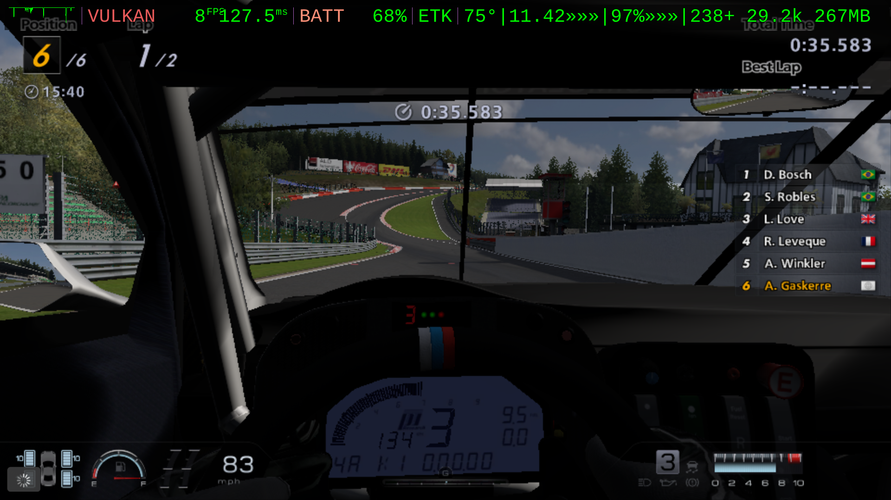

# The Emulation Tuning Kit

The Emulation Tuning Kit for Rocknix supports experimental PS3 emulation on ARM64 Retrogaming Handhelds. It excels a tuning games with device-specific emulation configurations while harvesting shaders into vaults. It also works by equipping your compatible handheld with special features to become a track day rig to literally and figuratively crash your way into making a game such as Gran Turismo 6 playable. Push your handheld to its limits while collecting shaders with tools to recover from crashes so the game plays well after several attempts. ETK automatically tracks sessions on a per-game race ledger.

## Racing UI
In the style of a race car Driver Data Unit (DDU) dashboard, the ETK instruments provide shader counts in real-time in a custom in-game overly using MangoHUD support built-in to Rocknix. The kit also adds a custom ETK Pitstop app in the Rocknix Tools carousel menu for on-board telemetry analysis, quick tuning of Adreno-centric emulation settings, and simplified game package installation. 

## Race Engineering
More technically, ETK is a custom Rocknix middleware composed of shell scripts and python curses that employ brute-force optimization, shader cache management, advanced in-game telematics, on-board screenshot tooling the includes the MangoHUD overlay, and operates an automated file-drop headless install of PS3 PKG installations inside of RPSC3. 

## Race Durability
Built for abuse and race conditions, the ETK guards hard-earned shaders, custom tunings, screenshots, and game saves from SD card failure, OS flashing, data corruption, device failure, loss or theft. The ETK includes an emergency cooldown that automatically puts your device in PIT mode as needed, protecting your engine from overheating.

## Screenshots
These images were created by the ETK's screenshot tool `L1` as a camera shutter function.


*GT6 — Trial Mountain, Lap 2, Position 2/6. Top Mounted DDU strip: `VULKAN 15FPS 68.9ms BATT 66% ETK 79° 11.96 96% 138+ 28.6k 261MB` — live FPS, frametime, battery, GPU temp + load, and the `138+` shader counter all rendered in the same frame as the gameplay. The `+` is the productive-crashing pitch made literal: even when frames stutter on shader storms, the rig is still banking shaders for the next run.*


*GT5P - Main Menu Garage showing game progression.*


*GT6 - Nurbrigring Nordschielfe at night*



*GT6 - BMW GT3 courtesy car at Spa*

More to come:
- Sample GT5P at 100% 720p
- Sample GT6 Nürburgring Nordschleife clean-lap screen.
- Sample ETK Pitstop app TELEMETRY ledger screen
- Sample ETK Pitstop app TUNING screen
- Sample ETK Pitstop app TOOLS PKG installer sequence screenshots

## ETK System Requirements
| Type | Detail |
|---|---|
| Host System | macOS or Linux (experimental Windows/PC support) |
| OS | ROCKNIX (Nightly Build: 20260525) |
| Driver | MESA Turnip 26.1.0 |
| Shell |  BusyBox v1.36.1 |
| Custom Overlay |  MangoHUD |

## Handheld System Support
| Make | Model | Chipset | Compatible | Road Tested |
|---|---|---|---|---|
| Retroid Pocket | Flip2 | SM8250 Adreno 650 | ✔︎ | 🏁 |
| Retroid Pocket | 5 | SM8250 Adreno 650 | ✔︎ | - |
| Retroid Pocket | Mini | SM8250 Adreno 650 | ✔︎ | - |
| Retroid Pocket | Mini V2 | SM8250 Adreno 650 | ✔︎ | - |
| AYN | Thor Lite | SM8250 Adreno 650 | ✔︎ | - |
| Retroid Pocket | 6 | New Tuning Required for Adreno 740 | - | - |

## Tested Games (RPCS3)
Snapshot of per-game status from on-device testing. Full tuning history, panic-ledger context, and the critical config dials per game live in [dossiers/etk_gametest_status_sheet.md](dossiers/etk_gametest_status_sheet.md).

| ID | Game | Status | FPS | Audio| Notes |
|---|---|---|---|---|---|
| NPUA80075 | [Gran Turismo Prologue](config/config_NPUA80075.yml) | Playable | ~30 | Menus only | Primary ETK target. Track surface flickers; Unstable over time. |
| NPEA90002 | [Gran Turismo HD](config/config_NPEA90002.yml) | Playable | 20–30 | Good (some race stutter) | Ideal baseline — small, fast, durable. Black sky artifacting; menus SPU-sensitive. |
| NPUB30457 | [Ridge Racer 7](config/config_NPUB30457.yml) | Semi-Playable | 20-30 | Good (some race stutter) | No progress, not durable for 3 lap min. Distant backgrounds sometimes don't load. |
| NPUA80472 | [LittleBigPlanet](config/config_NPUA80472.yml) | Playable | 12-24 | Good (some stutter) | No issues discovered yet beyond shader storm glitching. |
| NPEA00502 | [Gran Turismo 6](config/config_NPEA00502.yml) | Playable | <12 | Menus good | Full Nürburgring Nordschleife lap clean 2026-05-26. Tuning for FPS is deferred until the shader vault saturates. Rear-view mirror does not render. |
| BCUS98114 | [Gran Turismo 5](config/config_BCUS98114.yml) | Menus only | — | Menus only | Tracks kernel-panic. Menus stable, eventual freeze. |

## Launch ETK Edition: GTP5 SPEC
Specifically designed to make Gran Turismo 5 Prologue playable on a Flip2 Snapdragon, the ETK adopts the racing metaphor throughout but should work for any type of PS3 game. Surprisingly, the project has enabled Gran Turismo 6 for shader harvesting at 10fps and 75% 720p resolution.

## ETK Quick Commands
| Gamepad Button | ETK Command | Button Description | Details |
|---|---|---|---|
| `L1` | **screenshot** | left top trigger button | **Requires in-game un-binding/un-mapping**, Screenshots stored at `/storage/roms/etk/screenshots`, `install.sh` syncs `etk/screenshots` |
| `L3` | **DDU HUD** | left analog button | Toggles ETK DDU dashboard between top and bottom of screen |
| `R3` | **PANIC RECOVERY** | right analog button | Recover from a crash or freeze. Reboot recommended after returning to Rocknix ES frontend. |

# Getting Started
1. Flash a Rocknix nightly build (see the exact build in [ETK System Requirements](#etk-system-requirements) above) to your handheld's SD card and complete its first-time setup so the rig joins your WiFi. 
If you've already installed Rocknix, simply press `START` `UPDATES & DOWNLOADS` `UPDATE BRANCH` and switch to `NIGHTLY` and then let the auto-update complete and reboot first. 
**Do not update to the next Rocknix nightly after this** without checking the latest README.md for the last known ETK supported Rocknix release.
2. Clone this repo to your computer (macOS or Linux; experimental Windows via WSL2). 
You can also download the code as a `.zip` from the GitHub `<> Code` menu and extract as `/~etk/`
3. From the repo root, run `./install.sh`. **On the first run the installer auto-discovers your handheld as the rig.** You may be prompted once to accept the rig's SSH host key.
Using mDNS, Rocknix advertises itself on the LAN as `<SOC>.local` (e.g. `SM8250.local` for SD865 devices like the Retroid Pocket Flip 2 / Pocket 5).
4. Reboot and start harvesting shaders. 

## Customizing the ETK
1. The first run generates `etk.conf`from `etk.conf.example` 
   - `RIG_SSH` — auto-populated to `root@<SOC>.local`; replace with a literal IP if your LAN blocks mDNS
   - `ETK_BUILD_TYPE` — `FULL` (shaders + thermal + HUD) / `LITE` (thermal + HUD) / `RAW` (HUD only)
   - `DEFAULT_MODE`, `HUD_HEADER_HOLD_S` (HUD launch-banner hold)
   - `ETK_VERBOSE` — 0 = Pit Wall console TUI (default), 1 = raw rsync output for debugging. Pass `--verbose` / `-v` on the install.sh CLI to force verbose for a single run.
2. Re-run `./install.sh` after any `etk.conf` edit to push changes to the rig.
3. Reboot the rig once to activate the ETK Pitstop entry in the Rocknix Tools menu.

## ETK Features
1. Native Rocknix ETK Pitstop App for on-device config editing, per game telemetry analysis over time, and simple PS3 game installation (drop .pkg and .rap in `roms/etk/pkg_install_drop/`)
1. Customized in-game overlay dashbard with ETK telematics inside native Rocknix MangoHUD
1. Hardware and driver tunings for maximum performance going beyond config settings
1. Optimized emulator game configurations tuned to the device hardware
1. Smart thermal protection to safely overdrive the device during shader harvesting
1. Automatic shader backup from your device to computer to shield hard earned work from loss and to share with other ETK users
1. Pit wall remote terminal screen to monitor and control device (`scripts/commander.sh`)
1. Install, configure, repair, and uninstall the kit remotely from a computer (`install.sh` and `uninstall.sh`) with mDNS autodiscovery of supported devices on your local network.
1. Multi-Installation Options: FULL installation for initial shader harvesting and tuning, LITE installation for saturated shader sets with thermal protection only, RAW for stress testing without shader and thermal protections (`ETK_BUILD_TYPE` in `etk.conf`)

## ETK File Structure
- `AI_MANIFEST.md`: System Manual and Immutable Laws of ETK Development for AI
- `README.md`: You are reading it now.
- `etk.conf.example`: Operator config template — committed. `install.sh` generates `etk.conf` from this on first run.
- `install.sh`: Flashes the ETK onto your handheld from a computer; auto-discovers the rig via mDNS on first run.
- `uninstall.sh`: Removes the ETK from your handheld from a computer
- `/bin`:
  - `etk_modules_inject.py`: Handles installing native Rocknix PITSTOP app persistently
  - `etk_pitstop.py`: Handles native Rocknix Tools App TELEMTRY, TUNING, TOOLS
  - `input_d.py`: Handles custom gamepad controls
  - `mango_bridge.sh`: Manages live telemetry and overlay display
  - `recovery.sh`: Headless Nuclear Recovery, invoked on-device by the `R3` panic button
  - `session_postmortem.sh`: Handles recording Simple Telemetry to PITSTOP session ledger
  - `thermal_d.sh`: Handles system conditions and emergency cooldown
  - `vault_d.sh`: Handles archival of compiled shaders
- `/config`:
  - `crash_signatures.json`: Defines crash reporting analytics
  - `etk_pitsop.sh`: Native Rocknix app launcher gets installed into device
  - `etk_pitsop.svg`: Native Rocknix app icon gets installed into device
  - `etk_template.yml`: Default emulator template for game packages installed with TOOLS
  - `MangoHud.config`: Handles custom in-game on-screen overlay
  - `pistop_fields.json`: The subset of RPCS3 config settings for on-device edits
  - `rsyncd.config`: Handles deployment and backup between handheld and computer
- `/scripts`:
  - `career_aggregate.sh`: Handles summarizing session ledger into stats for PITSTOP app
  - `commander.sh`: Pit Wall DDU UI for the terminal interface
  - `env.sh`: Establishes pit and race environment variables
  - `probe.sh`: Provides error logs
- `/tools`: various utilities used during ETK development
- `/vault`: Large archive of Vulkan precompiled shader bins organized by chipset and gameID

## Custom ETK Gamepad Specifications
- Reserved:
  - `START` + `SELECT` + `R1` = Native Rocknix force quit
  - `HOME` = RPCS3 menu
  - `SELECT` = GT5P camera view toggle
- Implemented:
	- `R3` = PANIC BUTTON RECOVERY COMMAND (headless on-device Nuclear Recovery, single press)
	- `L3` = MangoHUD position toggle (top-left ⇄ bottom-left), auto-remembered per game. Bottom-left is the dashboard default; flip to top-left for games whose HUD elements crowd the bottom edge (e.g. GT5P). Sentry applies the per-game preference at ignition.
	- `L1` = ETK SCREENSHOT (in-race recommended). Silent `grim` capture of the full Wayland surface — **MangoHUD overlay included**, which is the whole point (RPCS3's internal screenshot strips the HUD). Single-button trigger so no chord pass-through to the game. **Onboarding pre-flight:** unbind `L1` in each PS3 game's controls (in GT5P/GT6 it defaults to Rear View camera toggle. Doing this is a natural part of the first-launch settings to disable audio. Shots land in `/storage/games-internal/roms/etk/screenshots/` as `etk_<gameID>_<YYYYMMDD>_<HHMMSS>.png`, instantly visible via the `[games-internal]` SMB share at `\\<rig-ip>\games-internal\roms\etk\screenshots\`. Backed up to the host on every `install.sh`.
	- `SELECT` + `D-pad Up` = ETK SCREENSHOT (UI/menu fallback). Same capture as L1 above; use this in Pitstop / EmulationStation / dealership / pause menu contexts where L1 has unwanted side effects (Pitstop tab nav). Not recommended in-race — SELECT also triggers the game's camera view toggle, so the captured frame will catch mid-transition.
	- `SELECT` + `D-pad Right` = manual VAULT command (force a shader-vault tick)
	- `SELECT` + `D-pad Left` = MangoHUD config reload signal
	- Thermal failsafe (internal): on overheat, the rig auto-drops to PIT (capped CPU/GPU), the HUD reads `OVERHEAT - REBOOT`, and a cold-boot is the prescribed recovery path to fully restore overdrive performance.
	
## How to Install PS3 Games with the ETK
The ETK solves the problem of installing PS3 Packages on Rocknix which is otherwise a ridiculous process.
1. Place a single PS3 `.pkg` and `.rap` into `/storage/roms/etk/pkg_install_drop/`
1. In Rocknick Tools > ETK Pistop > TOOLS > Install a stage PS3 package
1. Wait for the automated process where ETK will handle RPCS3 installation for you and follow the on screen overlay instructions
1. Quit ETK Pitstop after installation and Update Gamelists in Rocknix

## How to Use Simple Telemetry
The ETK Pitstop Rocknix Tools app records your sessions for each game. You must launch a game and quit to switch which app the ETK Pitstop app will display. It records your tuning changes in a session ledger with summary statistics to help you determine which settings have resulted in better play results.

# FAQ: What is the ETK and How Does it Really Work?
- **To enhance how the built-in PS3 emulator handles shader caching,** the ETK intercepts the Vulkan shader cache with a simple symlink and safely stores these files into a vault folder on your SD card organized by device and game ID so they can be archived and shared. Even when you crash during a shader harvesting run, the vault has saved the shaders for the next run.
- **To enhance how the device handles high demand games during the shader compiling process and high performance gaming,** the ETK manages the system temp and performance to safely overtax the device when it needs to work the hardest while preventing a total meltdown. It also modifies how the OS manages virtual memory and fine tunes the video driver.
- **To enhance how you can monitor the device system stress while pushing it to its limits,** the ETK enables a custom dashboard overlay using built-in Rocknix features across a thin horizontal HUD strip designed to evoke the Driver Data Unit (DDU) found in GT and F1 racing cars. The custom HUD DDU also shows the number of shaders harvested during a game session so you realize even if you crash, it was worth it.
- **To streamline how you can tweak key emulation settings,** the ETK PITSTOP app in the Rocknix Tools menu, inspired by pit wall screens, allows you to easily adjust selected configuration settings using the gamepad controls. The subset of on-board configs can be customized in a JSON file. 
- **To solve the problem of installing `.pkg` files with the desktop version of RCPS3 inside of Rocknix with only a gamepad,** the ETK automates the process for you. All you do is drop files in a folder on your card and use ETK Pitstop Tools to start the process.
- **To simplify managing game shader vaults and software updates,** the ETK includes a simple command-line utility to install, repair, update, and automatically sync shader vaults as you harvest from games or trade device and game-specific shader folders with others. It also includes an uninstall utility to retire from the league. A typical game 300+ MB shader vault will involve tens of thousands of binary files so an efficient transfer mechanism to manage shader sets between a computer and the handheld devices is essential.
- ETK does all of this while trying to maintain a **minimal system footprint without subjecting your SD card to abuse.**

# Warnings and Recommendations
- Requires the patience and dedication of race car drivers. You will crash. But you will also win races that could otherwise not be played. ETK doesn't magically make your device run PS3 emulation, it only gives it a fighting chance with professional grade tools and system tunings. Shader sharing spares other players the harvest.
- Requires the exact Rocknix Nightly specified above. This does not work on the official release nor has it been tested or updated for other Rocknix nightly builds.
- Do not use your main ROM library SD card for this Rocknix install. Instead, use a reasonably sized (256GB or less) high quality dev card that you don't mind wearing out or needing to reflash. Put your favorite PS3 games on this card and wait until the ETK can be upgraded for a Rocknix (official) release before using on your main card.
- Do not install on your handheld device if you intend to use the warranty coverage or otherwise would protect it from track day abuse. If you wouldn't take your daily driver to the track, do not install highly experimental software on your only retro handeld the could potentially damage or brick it.
- OS updates, ETK uninstalls and other major system events may require a PPU recompilation which do take time. Putting the device on an ice pack or in the refrigerator will reduce thermal stress on the system during these intensive operations. 
- The ETK is designed with community shader sharing in mind.
	  
# Project History
- Phase 1: MVP proof-of-concept: now deprecated monolithic mvp/commander.sh achieved initial shader cache accumulation downscaled with no audio, essential commands and Excitebike UX proofed
- Phase 2: Modular professional grade deployable ETK: shader cache successfully upscaled
- Phase 3: Enabled on-board MangoHUD DDU: integrated live instrumentation
- Phase 4: Enabled Gamepad ETK pit controls: full un-tethered racing and shader harvesting
- Phase 5: Solved SD card treadwear and boost persistence with RAM disk support
- Phase 6: Rocknix OS migrated to May 11 Nightly, dependency updated, preserved into repo, 
- Phase 7: Enabled robust crash reporting, diagnosis, advisory, ETK install tiers
- Phase 8: Attempted experimental incremental audio support
- Phase 9: Enabled game agnostic ETK
- Phase 10: Onboard ETK Commands: `R3` as Recovery Panic Button and 
- Phase 11: Onboard ETK Commands: `L3` as MangoHUD screen position toggle
- Phase 12: Developing native Rocknix ETK app for utilities (Tools or carousel UI)
- Phase 13: Alpha Testing
- Phase 14: Develop tuning and shader sharing; Rig self-updates ETK from GitHub in Pitstop App
- Phase 15: Beta Testing

# Windows Install Guide 
- (alpha-tester preview, needs testing)
A native PowerShell installer is in early prototype (`windows_installer/`). Until it ships, the recommended Windows path is **WSL2**: install WSL2 + Ubuntu, clone the kit, and follow the `# Easy Install Guide (FULL Kit)` above unchanged. `install.sh` runs in WSL2 with no modifications and Tier-B auto-backup works the same as on macOS/Linux.

For the one-time fresh-card flash, use the official Rocknix  [ImageBurner](https://github.com/ROCKNIX/ImageBurner/releases) — Windows-native, no dependency to install the correct nightly (not official) required for the ETK.

## Manual SMB Backup
- (stand-in until the PowerShell installer ships)
If you are on the PowerShell installer prototype (no Tier-B yet) or want belt-and-suspenders, Rocknix exposes Samba shares natively. In File Explorer, `Map network drive...` → `\\<rig-ip>\games-internal` → assign a letter (e.g. `R:`). Then save this as `etk_backup.bat` and run it before any reflash or risky migration:

```bat
robocopy R:\roms\etk\vault                  C:\etk_backup\vault           /MIR /R:1 /W:1
robocopy R:\roms\etk\etk_telemetry          C:\etk_backup\etk_telemetry   /MIR /R:1 /W:1
robocopy R:\roms\bios\rpcs3\custom_configs  C:\etk_backup\custom_configs  /MIR /R:1 /W:1
robocopy R:\roms\bios\rpcs3\dev_hdd0\home   C:\etk_backup\rpcs3_home      /MIR /R:1 /W:1
```

`robocopy /MIR` is Windows-native (no install), incremental like `rsync`, and idempotent — re-run as often as you like. To restore after a reflash, swap source and destination in each line. **Manual caveat:** you must remember to run the backup yourself; there is no Windows equivalent of `install.sh --restore-state` yet.


# AI Disclosure
ETK was originally prototyped with Google Gemini and developed/maintained with Anthropic Claude Code.

# License
ETK is released under the [GNU General Public License v2.0](LICENSE), matching the licensing of [Rocknix](https://github.com/ROCKNIX/distribution) which it extends.

Copyright (C) 2026 mercurious